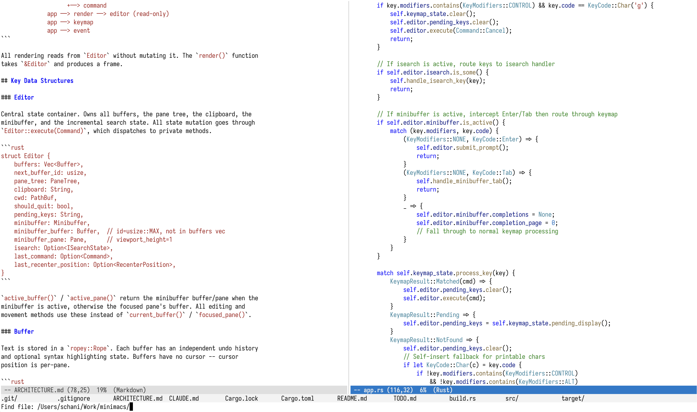

# minimacs

A terminal text editor with emacs keybindings, written in Rust.

minimacs aims to be a fast, lightweight editor that feels familiar to emacs
users. It is not extensible -- it ships one good editor, not a platform.



## Features

- **Emacs keybindings** -- standard movement, editing, and chord sequences
  (`C-x C-s`, `C-x C-f`, `M-g g`, etc.)
- **Multiple buffers** -- open, switch, and kill buffers
- **Pane splits** -- vertical and horizontal splits with per-pane cursors
- **Syntax highlighting** -- tree-sitter based, supporting 13 languages
- **Incremental search** -- `C-s`/`C-r` with live match highlighting
- **Undo/redo** -- grouped edits with automatic boundary detection
- **OS clipboard** -- copy/paste integrates with the system clipboard
- **Line ending detection** -- CRLF files are edited as LF in memory and
  saved back with their original ending
- **Bracketed paste** -- pastes multi-line text as a single undo group

## Supported Languages

Rust, JavaScript, TypeScript, TSX, JSON, TOML, Go, HTML, Bash, YAML, Markdown,
Env (`.env` files, using bash grammar), Git Commit (`COMMIT_EDITMSG`,
`MERGE_MSG`, etc. — minimacs works as `core.editor`).

Language is auto-detected from file extension or filename. The detected language
is shown in the mode line.

## Installation

```sh
cargo install --git https://github.com/schani/minimacs
```

This requires the Rust toolchain and a C compiler (for tree-sitter grammars).

To install without OS clipboard support:

```sh
cargo install --git https://github.com/schani/minimacs --no-default-features
```

## Building

Requires Rust 1.70+ and a C compiler (for tree-sitter grammars).

```sh
cargo build --release
```

The binary is at `target/release/minimacs`.

To build without OS clipboard support (removes the `arboard` dependency):

```sh
cargo build --release --no-default-features
```

### Syntax edit benchmark

The `syntax-bench` CLI compares the cost of applying the same deterministic
edits with full parsing, persistent incremental parsing, and no parsing:

```sh
cargo run --release --bin syntax-bench -- --lines 10000 --edits 100
```

Use `--mode full`, `--mode incremental`, or `--mode none` to run one strategy.
The default `all` mode also verifies that every strategy produces identical
final text and that full and incremental parsing produce identical highlight
checksums. Run `syntax-bench --help` for all options. Release mode is important
for representative timings.

### Syntax fuzz harness

The `syntax-fuzz` CLI applies random edits through the editor's real edit
path and, after every edit, compares the incremental tree's highlights
against a fresh parse of the same text — whole-file and over a random
viewport window. It exits 1 with a one-line reproduce command on divergence:

```sh
cargo run --release --bin syntax-fuzz                       # default sweep
cargo run --release --bin syntax-fuzz -- --lang all --runs 8 --steps 400
cargo run --release --bin syntax-fuzz -- --lang json --seed 3 --steps 82
```

Edits mix a plain alphabet with an adversarial one (CR/CRLF fragments,
Unicode separators, combining characters, fence/quote/comment tokens, big
pastes) and target structural hotspots; runs are deterministic per `--seed`.
`--keep-going` probes whether a divergence self-heals, and `--raw` attributes
it to tree-sitter core versus tree-house. Run `syntax-fuzz --help` for all
options. Known limitation: on heavily corrupted buffers, tree-sitter's
incremental error recovery can transiently differ from a fresh parse
(upstream behavior, self-healing) — deep sweeps report those.

## Usage

```sh
# Open a file
minimacs src/main.rs

# Start with an empty scratch buffer
minimacs
```

## Keybindings

### Movement

| Key | Action |
|-----|--------|
| `C-f` / Right | Forward character |
| `C-b` / Left | Backward character |
| `M-f` | Forward word |
| `M-b` | Backward word |
| `C-n` / Down | Next line |
| `C-p` / Up | Previous line |
| `C-a` / Home | Beginning of line |
| `C-e` / End | End of line |
| `C-v` / PgDn | Page down |
| `M-v` / PgUp | Page up |
| `M-<` | Beginning of buffer |
| `M->` | End of buffer |
| `M-g g` | Go to line number |

### Editing

| Key | Action |
|-----|--------|
| Printable chars | Self-insert |
| Enter | Insert newline |
| Tab | Insert 4 spaces |
| Backspace | Delete backward |
| `C-d` / Delete | Delete forward |
| `C-k` | Kill line (cut to end of line) |
| `C-/` or `C-_` | Undo |
| `C-M-/` or `C-M-_` | Redo |

### Mark and Region

| Key | Action |
|-----|--------|
| `C-Space` | Set mark |
| `C-w` | Cut region |
| `M-w` | Copy region |
| `C-y` | Paste |
| `C-x C-x` | Swap point and mark |

### Files and Buffers

| Key | Action |
|-----|--------|
| `C-x C-f` | Find file (open) |
| `C-x C-s` | Save |
| `C-x C-w` | Write file (save as) |
| `C-x b` | Switch buffer (`RET` with empty input jumps to the last buffer in that pane) |
| `C-x k` | Kill buffer |

### Panes

| Key | Action |
|-----|--------|
| `C-x 2` | Split vertically |
| `C-x 3` | Split horizontally |
| `C-x 0` | Delete current pane |
| `C-x 1` | Delete other panes |
| `C-x o` | Cycle focus to next pane |

### Search

| Key | Action |
|-----|--------|
| `C-s` | Incremental search forward |
| `C-r` | Incremental search backward |

During incremental search: `C-s`/`C-r` cycle matches, Enter accepts, `C-g`
cancels and restores the original position.

### Other

| Key | Action |
|-----|--------|
| `C-g` | Cancel (clears pending keys, deactivates mark, cancels prompts) |
| `C-x C-c` | Quit (prompts to save modified buffers; `a` aborts with exit status 1, for git) |

## Testing

```sh
cargo test
```

The test suite includes unit tests for every module, integration tests that
drive the full editor through a `TestBackend`, and snapshot tests for rendered
output.

CI (GitHub Actions, `.github/workflows/ci.yml`) runs on every pull request and
on pushes to `main`. It mirrors the pre-commit hook — build, tests behind the
90% line-coverage threshold (`cargo llvm-cov`), and `cargo clippy -D warnings`
— plus a syntax-subsystem smoke check: a short `syntax-fuzz` sweep and a
`syntax-bench` checksum run.

## License

MIT License. See [LICENSE](LICENSE) for details.
